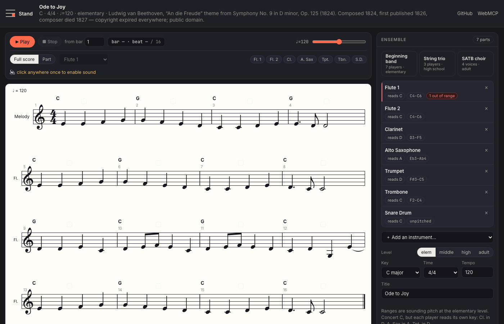
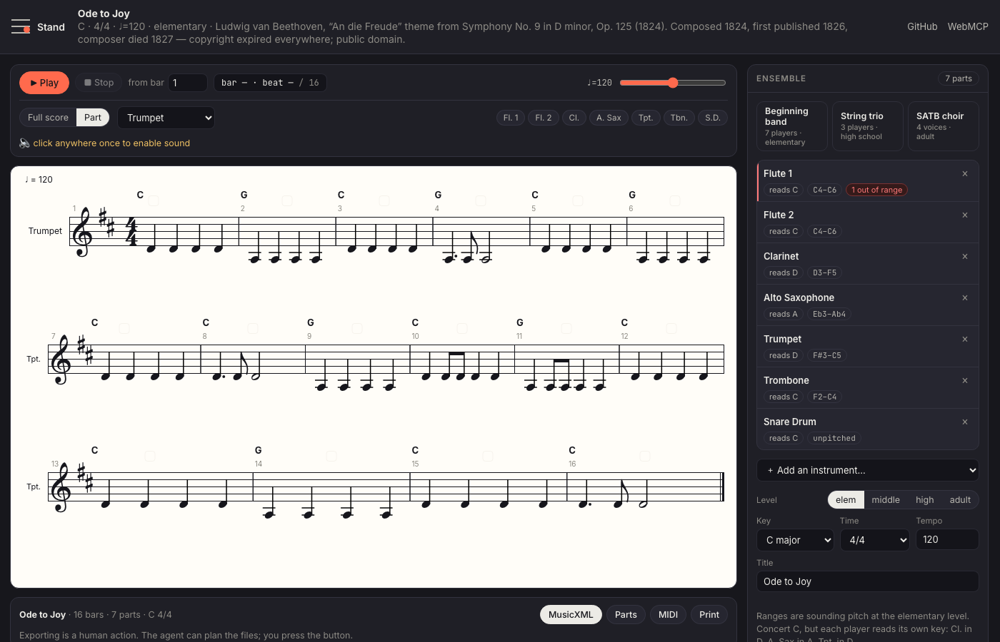

# Stand — an arranging studio your agent can write in

**Live:** https://stand.znehraks.workers.dev · **Repo:** https://github.com/znehraks/stand · **License:** MIT · Built for the [OpenAI WebMCP Challenge](https://webmcp.devpost.com/)

Bring a melody, your ensemble and your students' level. Say *"arrange this for my fifth-grade band — two flutes, clarinet, alto sax, trumpet, trombone, snare."* Your agent writes the parts **into the score**, one at a time. The page renders them, plays them, and **checks every note against that instrument's range at that level** — a trumpet D6 for beginners is refused with the bar, the note and the fix, and the agent corrects itself. When two endings are both defensible, the agent **plays you both and waits**: it cannot hear, you can. You drag notes by hand, lock the bars you like, and export parts your players can read.



**What the page refuses, verbatim** (a live call against the deployed site):

```
write_part { part: "trumpet", from_bar: 1, bars: [{ notes: [{ pitch: "D6", dur: "w" }] }] }
→ { ok: false,
    error: "Trumpet bar 1 note 1: written E6 (sounding D6) is above the elementary range
             F3–C5 sounding (G3–D5 written).",
    issues: [{ kind: "range", suggestion: "Drop it an octave to sounding D5 (written E5)." }] }
```

The agent reads that and rewrites the bar. Even the tune itself gets caught: Ode to Joy dips to a low G in bar 12, below a beginner flute, and the page says so before anyone hands out parts.

| Conductor score, seven parts | The transposed part a player reads |
|---|---|
|  |  |

---

## Try it in 90 seconds

### With ChatGPT (the intended experience)
1. Open **https://stand.znehraks.workers.dev** in the built-in browser of the **ChatGPT desktop app** (model **Sol** or **Terra**).
2. Say: *"Load Ode to Joy, set up a beginning band — two flutes, clarinet, alto sax, trumpet, trombone, snare — at elementary level, and arrange it."*
3. Watch the staves fill in. When a note leaves a beginner's range the page refuses the write and names the fix; the agent writes it an octave lower.
4. Say *"play the first four bars"* — the page asks you to click once (browsers only start audio on a gesture), then plays.
5. Say *"give me two options for the last two bars and let me hear them"* — a card appears with ▶ on each option. **The agent waits for your ear.**
6. Lock a bar you like (🔒 above the bar), then say *"rewrite the trumpet part"* — the locked bar comes back untouched.
7. Say *"show me the trumpet part alone"* — it appears in its written key, a step up from concert. Then export parts, MusicXML or MIDI with the buttons.

### With Chrome 149+
Enable `chrome://flags/#enable-webmcp-testing`, install the [Model Context Tool Inspector](https://chromewebstore.google.com/detail/webmcp-model-context-tool/gbpdfapgefenggkahomfgkhfehlcenpd), and call the tools yourself.

### With no agent at all
Press **▶ Watch a 60-second demo** on the start screen, or open the site with `?judge=1`. A scripted demo drives the **same registered tools**, including the rejected out-of-range write and the A/B listening choice. Every control also works by hand.

> **For judges:** no login, no credentials, nothing to install. Six public-domain melodies ship with the app, so there is no file to upload before you can see the whole loop.

---

## Why this needs WebMCP

**1. The page knows things the agent cannot fake — so the page can refuse.** Notation, playback, per-instrument ranges at four teaching levels, and transposition all live in the page. That turns the tool boundary into a music guardrail: `write_part` **rejects** a bar that does not fill the bar, a pitch it cannot read, or a note outside the instrument's sounding range at the score's level, and returns the bar number, the written *and* sounding pitch, the allowed range and a concrete fix. The agent self-corrects from the error instead of writing something a child cannot play. An agent driving a UI through screenshots gets none of that, and a backend MCP server cannot show the person the score it is changing.

**2. The agent cannot hear. The person can.** `ask_human` takes playable options: the page renders and sounds each candidate passage, the person listens and chooses, and only then does the agent continue. This is not a confirmation dialog bolted onto a chatbot — it is the one judgement a language model genuinely cannot make, handed back to the human by design.

**3. One score, two hands.** The person drags a note, locks a bar, mutes a part, switches to the transposed part view; the agent writes around all of it (`write_part` skips locked bars and says which). Every tool call and every hand edit lands in the same timeline. Nobody copy-pastes MusicXML through a chat window.

## Why it beats what exists

| | Stand | MuseScore / Flat / Noteflight | Suno-style generators | Transcribers (Songscription…) |
|---|---|---|---|---|
| Agent writes into the score | **yes, as tools** | no agent | n/a | no |
| Output your players can read | parts, MusicXML, MIDI | yes | audio only | score from audio |
| Fits *your* ensemble and level | **enforced by the page** | you check by hand | no | no |
| The human decides by ear | **built into the protocol** | manual | after the fact | n/a |

Arranging for a real school ensemble is not composition — it is *fitting*: six clarinets and no trombone, a first-year trumpet who tops out at G5, a key with two flats because that is what the class can read. That fitting is exactly what a language model is good at proposing and bad at verifying, and exactly what a page can verify instantly.

## Tool surface

Tool surfaces are swapped with `AbortSignal`s as the phase changes, so an agent never sees a tool it cannot use — **18 tools while arranging, 21 across the three surfaces**. The canonical contract is [`docs/TOOLS.md`](docs/TOOLS.md).

| Phase | Tools |
|---|---|
| `empty` | `get_score` · `list_melodies` · `list_instruments` · `load_melody` |
| `arranging` | `get_score` · `read_part` · `list_instruments` · `set_ensemble` · `set_meta` · `set_key` · `set_time` · `write_part` · `write_chords` · `harmonize` · `transpose` · `check` · `play` · `stop` · `ask_human` · `set_view` · `undo` · `export_plan` |
| `exported` | `get_score` · `export_plan` · `reopen` (asks the person first) |

Design notes that matter for agents:
- **Bars are 1-based in the API**, 0-based in the store; converted at the boundary, including inside error text.
- **Pitches are sounding (concert) pitch.** The page transposes for each part and returns both spellings from `read_part`, so an agent never has to do transposition arithmetic — and cannot get it wrong.
- Reads carry `readOnlyHint`. Every mutating result reports what changed plus a `next_step`. Every failure returns `{ ok: false, error, issues }` written for self-correction.
- `play` returns `{ needs_gesture: true }` when the browser has not started audio yet, so the agent knows to ask for a click instead of silently failing.
- **No tool can export, print, lock a bar, or answer a question for the person.** Those are buttons.

## Architecture

```
src/core/types.ts        the frozen data model (sounding pitches, tick durations, levels)
src/core/pitch.ts        pitch + key arithmetic (midi, spelling by key signature, written keys, fifths)
src/core/instruments.ts  20+ instruments: clef, transposition, and a sounding range per teaching level
src/core/check.ts        the guardrail: bar length, unknown pitch, range, level-appropriate rhythm and key,
                         leaps, voice crossing, parallel fifths — errors reject a write, warnings report
src/core/harmonize.ts    rule-based block / pad / countermelody voicing, always inside every range
src/core/exporters.ts    MusicXML (with correct <transpose> per part), per-part MusicXML, MIDI, text summary
src/store.ts             one store for every mutation: locks, undo, activity log, ask_human
src/render/ScoreView.tsx VexFlow conductor score and transposed part view, click-to-edit, lock badges, cursor
src/audio/player.ts      Tone.js playback, per-section timbres, A/B variant preview, cursor events
src/lib/tools.ts         the WebMCP surfaces above
src/lib/judge.ts         the scripted no-agent demo
```

Everything runs in the page. There is no server: the Worker only serves static assets, and nothing about a score ever leaves the browser unless the person exports a file.

## Run locally

```bash
npm install
npm run dev            # Vite + the Cloudflare plugin
npm test               # 104 unit tests: pitch/key math, ranges, checker, harmony, exporters, presets, playback
npm run test:e2e       # 8 Playwright tests driving every tool through a document.modelContext stand-in:
                       # the refused write, the locked bar, the human's A/B choice, export-is-human-only
npm run deploy         # vite build && wrangler deploy
```

## License

MIT — see [LICENSE](LICENSE). Melodies shipped with the app are public domain, each with its source named in `src/data/presets.ts`. Built by Jeongmin Yu ([@znehraks](https://github.com/znehraks)) for the WebMCP Challenge.
